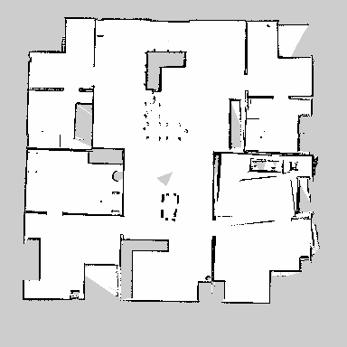

# ROS_SLAM_Navigation
A ROS program of a turtlebot burger generating a map and then automatically navigating through the four main rooms. 

Run: roslaunch ROS_SLAM_Navigation navigating.launch

Generated map:

Navigating through map:

